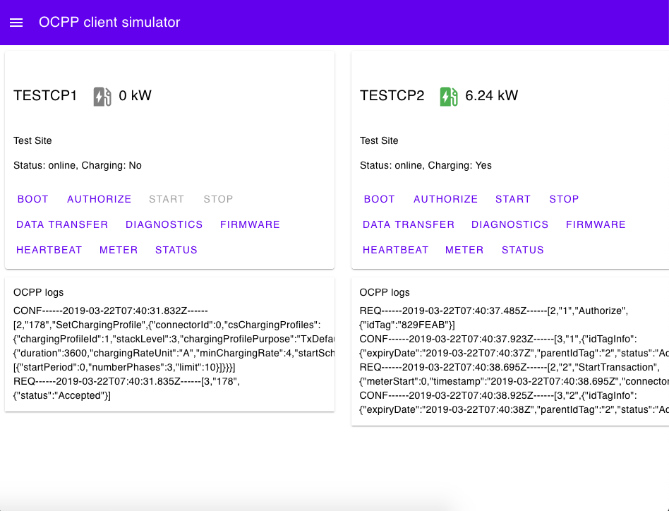
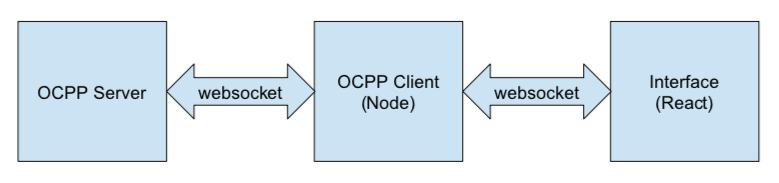

# OCPP 1.6 client

An OCPP client implementaiton in node.js for testing purposes.

## OCPP profiles

- Core
- Smart Charging

## Operations

- all operations initiated by charge point
- operations initiated by central system:
    - `ClearChargingProfile`
    - `GetCompositeSchedule`
    - `GetConfiguration`
    - `GetLocalListVersion`
    - `RemoteStopTransaction`
    - `SendLocalList`
    - `SetChargingProfile`
    - `TriggerMessage` for `BootNotification`

## Run

1. `npm install`
1. modify the following config and data files

- `config.js`
- `data/users.js`
- `data/chargepoints.js`

3. `npm start`
4. open `localhost:5000` on your browser

## How it works

The OCPP client (charge point) is a websocket client to the OCPP server (central system). The OCPP client also hosts a websocket server for the web interface.

Requests are initiated from the interface, sent to the OCPP client, and relayed to the OCPP server. Responses from the server are sent down to the client first and the client notifies the interface for UI updates.

Requests from client to server are handled in `src/requestHandler.js`. Responses from server to client are handled in `src/responseHandler.js`. New operation and modification can be added to these two files as these handlers are separated from the websocket client.

## Smart Charging

Client-side support for smart charging is implemented in `ocpp/chargeingProfiles`. `ChargePointMaxProfile` and `TxDefaultProfile`/`TxProfile` are combined to derive the composite profile. The instantaneous limit is calculated from the composite profile.

Server-side smart charging can be found [here](server/addons/README.md). The implementation is based on BCIT's OpenOCPP v1.1.1, and it requires modification on its source code.